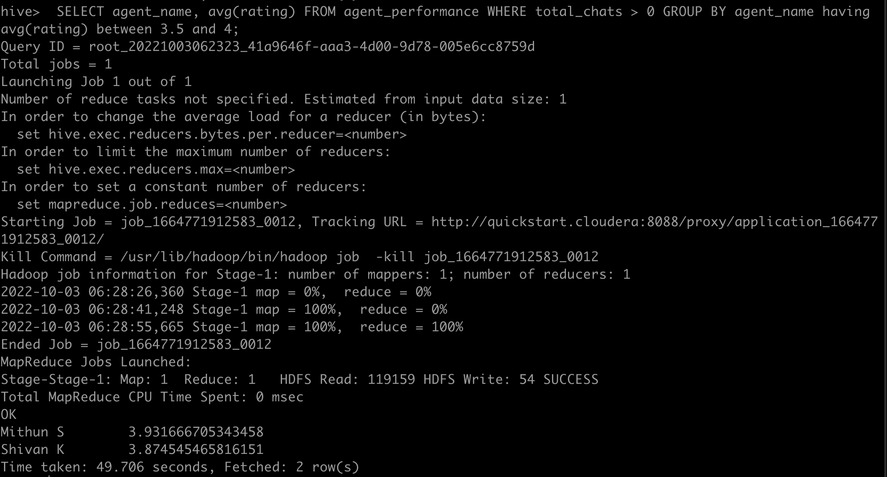
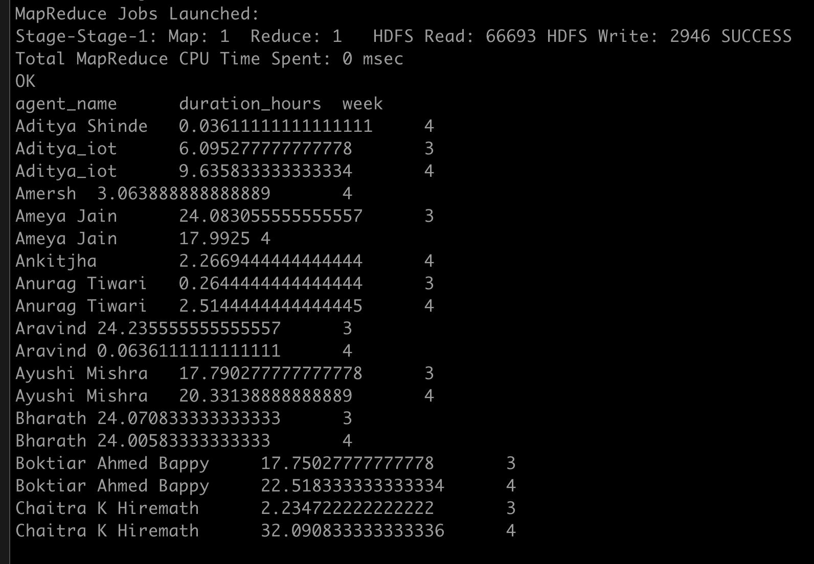

[Data-Set-1 AGentLoggingReport] (https://drive.google.com/file/d/1WrG-9qv6atP-W3P_-gYln1hHyFKRKMHP/view
)

[Data-set-2 Agent Performance] (https://drive.google.com/file/d/1-JIPCZ34dyN6k9CqJa-Y8yxIGq6vTVXU/view)

Note: both files are csv files.)]

## 1. Create a schema based on the given dataset

        CREATE TABLE
            (
            id int,
            agent_name string,
            date string,
            login_time string,
            logout_logout string,
            duration string
            )
            row format delimited
            fields terminated by ','
            tblproperties ("skip.header.line.count" = "1");


        CREATE TABLE agent_performance
       (
          id int,
          date string,
          total_chats int,
          average_response_time string,
          average_resolution_time string,
          rating float,
          feedback int
          )

    row format DELIMITED
    fields TERMINATED by ','
    tblproperties ("skip.header.line.count" = "1");


## 2. Dump the data inside the hdfs in the given schema location.
    hadoop fs -put /data/Hive_Assingments/AgentLogingReport /tmp
    hadoop fs -put /data/Hive_Assingments/AgentPerformance /tmp

-----
    CREATE TABLE agent_performance_date
     (
        id int,
        date date,
        agent_name string,
        total_chats int,
        average_response_time string,
        average_resolution_time string,
        rating float,
        feedback int
     )
     row format delimited
     fields terminated by ','


    INSERT OVERWRITE TABLE agent_performance_date
        SELECT
         id,
         from_unixtime(unix_timestamp(date,'MM/dd/yyyy'),'yyyy-MM-dd'),
         agent_name, total_chats, average_response_time, average_resolution_time, rating, feedback
         FROM
         agent_performance;


---
     CREATE TABLE agent_logging_report_date
     (
        id int,
        agent_name varchar(40),
        date date,
        login_time string,
        logout_time string,
        duration string
        )
     row format delimited
     fields terminated by ',';

    INSERT OVERWRITE TABLE agent_logging_report_date
        SELECT
         id,
         agent_name,
         from_unixtime(unix_timestamp(date,'dd-MMM-yyyy'),'yyyy-MM-dd'),
         login_time, logout_time, duration
        FROM
         agent_logging_report;

---


## 3. List of all agents' names.

        SELECT distinct agent_name FROM agent_performance_part_bucket

## 4. Find out agent average rating.

    SELECT agent_name, avg(rating) as avg_rating FROM agent_performance_part_bucket WHERE total_chats > 0 GROUP BY agent_name;

    agent_name	avg_rating
    Aditya Shinde	4.500833352406819
    Aditya_iot 	4.138823537265553
    Ameya Jain	4.43933334350586
    Anirudh 	2.7642857006617954
    Ankitjha 	2.6666666666666665
    Anurag Tiwari	2.75
    Aravind 	4.674285752432687
    Ashad Nasim	2.5
    Ayushi Mishra	4.352499961853027
    Bharath 	4.711052618528667
    Boktiar Ahmed Bappy	4.116923057115995
    Chaitra K Hiremath	4.323333303133647
    Deepranjan Gupta	4.12380956468128
    Dibyanshu 	0.0
    Harikrishnan Shaji	4.167894714757016
    Hitesh Choudhary	0.0
    Hrisikesh Neogi	4.480476186389015
    Ishawant Kumar	4.42916668454806
    Jawala Prakash	4.166400022506714


---
## 5. Total working days for each agents
    SELECT agent_name, count(date) as t_w_days (SELECT distinct agent_name, date FROM agent_logging_report) as total_w_days;

    agent_name	t_w_days
    Aditya Shinde	1
    Aditya_iot	8
    Amersh	2
    Ameya Jain	7
    Ankitjha	2
    Anurag Tiwari	10
    Aravind	7
    Ayushi Mishra	9
    Bharath	8
    Boktiar Ahmed Bappy	9
    Chaitra K Hiremath	7
    Deepranjan Gupta	10
    Dibyanshu	9
    Harikrishnan Shaji	9
    Hrisikesh Neogi	9
    Hyder Abbas	2
---
## 6. Total query that each agent have taken

    SELECT agent_name, sum(total_chats) FROM agent_performance Group by agent_name;

## 7. Total Feedback that each agent have received

    SELECT agent_name, sum(feedback) FROM agent_performance Group by agent_name;


## 8. Agent name who have average rating between 3.5 to 4
      SELECT agent_name, avg(rating) FROM agent_performance WHERE total_chats > 0 GROUP BY agent_name having avg(rating) between 3.5 and 4;



## 9. Agent name who have rating less than 3.5

    SELECT agent_name, avg(rating) FROM agent_performance WHERE total_chats > 0 GROUP BY agent_name having avg(rating) < 3.5;

    Anirudh 	2.7642857006617954
    Ankitjha 	2.6666666666666665
    Anurag Tiwari	2.75
    Ashad Nasim	2.5
    Dibyanshu 	0.0
    Hitesh Choudhary	0.0
    Mahak 	3.0
    Maneesh 	1.6666666666666667
    Mukesh Rao 	2.5566666523615518
    Samprit 	0.0
    Tarun 	1.5
    Vivek 	3.0039999961853026
## 10. Agent name who have rating more than 4.5

    SELECT agent_name, avg(rating) FROM agent_performance WHERE total_chats > 0 GROUP BY agent_name having avg(rating) > 4.5;

    Aditya Shinde	4.500833352406819
    Aravind 	4.674285752432687
    Bharath 	4.711052618528667
    Jaydeep Dixit	4.524285759244647
    Mukesh 	4.644999980926514
    Saikumarreddy N	4.570000024942251
    Shivananda Sonwane	4.534999992166247
    Shubham Sharma	4.607619081224714
    Sudhanshu Kumar	5.0
    Suraj S Bilgi	4.680000066757202
    Wasim 	4.500000029802322


---
## 11. How many feedback agents have received more than 4.5 average

- count of  agents who have received average more than 4.5 feedback

   SELECT count(agent_name) FROM (SELECT agent_name,avg(feedback) from agent_performance WHERE total_chats >0 GROUP by agent_name HAVING avg(feedback) > 4.5) as agent_name_feedback;

   44

- Number of feedback agent have received more than 4.5

    SELECT  sum(feedback) FROM agent_performance WHERE feedback > 4.5;

    8976


## 12. average weekly response time for each agent
    with response_time_t as (SELECT agent_name, WEEKOFYEAR(date) as year_week, split(average_response_time,':') as ts FROM agent_performance_date WHERE total_chats >0)

         SELECT
             agent_name, year_week, avg(r_seconds) as avg_response_seconds
         FROM
            (SELECT agent_name, year_week, (ts[0]* 3600 + ts[1]*60 + ts[2]*1) as r_seconds FROM response_time_t) as response_time_seconds

          GROUP BY
             agent_name, year_week;


    agent_name	year_week	avg_response_seconds
    Aditya Shinde	26	83.0
    Aditya Shinde	27	66.2
    Aditya Shinde	28	79.0
    Aditya_iot 	27	70.5
    Aditya_iot 	28	72.8
    Aditya_iot 	29	42.2
    Aditya_iot 	30	60.6
    Ameya Jain	27	0.0
    Ameya Jain	28	45.6
    Ameya Jain	29	41.6
    Ameya Jain	30	49.5
    Anirudh 	27	108.4
    Anirudh 	28	55.5
    Ankitjha 	27	0.0
    Ankitjha 	30	66.5
    Anurag Tiwari	27	126.5

## 13. average weekly resolution time for each agents
    with resolution_time_t as (SELECT agent_name, WEEKOFYEAR(date) as year_week, split(average_resolution_time,':') as ts FROM agent_performance_date WHERE total_chats >0)

         SELECT
             agent_name, year_week, avg(r_seconds) as avg_resolution_seconds
         FROM
            (SELECT agent_name, year_week, (ts[0]* 3600 + ts[1]*60 + ts[2]*1) as r_seconds FROM resolution_time_t) as resolution_time_seconds

          GROUP BY
             agent_name, year_week;


    Total MapReduce CPU Time Spent: 0 msec
    OK
    agent_name	year_week	avg_resolution_seconds
    Aditya Shinde	26	1390.5
    Aditya Shinde	27	1265.4
    Aditya Shinde	28	1902.2
    Aditya_iot 	27	1084.5
    Aditya_iot 	28	1275.4
    Aditya_iot 	29	941.0
    Aditya_iot 	30	885.6
    Ameya Jain	27	107.0
    Ameya Jain	28	677.2
    Ameya Jain	29	697.0
    Ameya Jain	30	719.25
    Anirudh 	27	683.0
    Anirudh 	28	1074.5
    Ankitjha 	27	1282.0
    Ankitjha 	30	176.0
    Anurag Tiwari	27	1109.0
    Aravind 	27	1089.0
    Aravind 	28	1211.6
    Aravind 	29	1130.6
    Ashad Nasim	27	314.0
    Ayushi Mishra	26	1532.5
    Ayushi Mishra	27	1040.2
    Ayushi Mishra	28	1227.4
    Ayushi Mishra	29	1107.4285714285713
    Ayushi Mishra	30	1104.6


---
## 14. Find the number of chat on which they have received a feedback

- 9259

  SELECT sum(feedback) as total_feedback FROM agent_performance;

## 15. Total contribution hour for each and every agents weekly basis

    with agent_duration as (SELECT id,agent_name,(split(date,'-')[0])*1 as day,split(duration,':') as d FROM agent_logging_report)
            SELECT
             agent_name,sum(d_seconds)/3600 as duration_hours,week
         FROM
             (SELECT id,agent_name,
             CASE
                when day > 24 then 4
                when day > 16 then 3
                when day > 8 then 4
                else 1
            End as week,

             (d[0]*3600 + d[1]*60 + d[2]*1) as d_seconds  FROM agent_duration ) as agent_d_seconds
         GROUP BY
             agent_name,
             week;




## 16. Perform inner join, left join and right join based on the agent column and after joining the table export that data into your local system.

- inner join

    insert overwrite local directory '/join_agent_tables/inner_join'
    row format delimited
    fields terminated by ','

    SELECT
     log.id, log.agent_name, performance.date, log.duration, performance.total_chats

    FROM
        agent_logging_report_date as log join agent_performance_date as performance
        on log.agent_name = performance.agent_name limit 50;


- **left join**

        insert overwrite local directory '/join_agent_tables/left_join'
          row format delimited
          fields terminated by ','

          SELECT
              log.id, log.agent_name, performance.date, log.duration, performance.total_chats
          FROM
             agent_logging_report_date as log left join agent_performance_date as performance
          on log.agent_name = performance.agent_name;


- **right join**

      insert overwrite local directory '/join_agent_tables/right_join'
      row format delimited
      fields terminated by ','

        SELECT
             log.id, log.agent_name, performance.date, log.duration, performance.total_chats
        FROM
            agent_logging_report_date as log right join agent_performance_date as performance
                on log.agent_name = performance.agent_name limit 50;


## 17. Perform partitioning on top of the agent column and then on top of that perform bucketing for each partitioning.


    CREATE TABLE agent_performance_partition
       (
          id int,
          date string,
          total_chats int,
          average_response_time string,
          average_resolution_time string,
          rating float,
          feedback int
          )
       partitioned by (agent_name string);


       hive.exec.dynamic.partition.mode=nonstrict;

       INSERT OVERWRITE TABLE agent_performance_partition PARTITION(agent_name)

       SELECT
            id, date, total_chats, average_response_time, average_resolution_time, rating, feedback,agent_name
        FROM
            agent_performance;


        CREATE TABLE agent_performance_partition
       (
          id int,
          date string,
          total_chats int,
          average_response_time string,
          average_resolution_time string,
          rating float,
          feedback int,
          agent_name
          )
          clustered by (id)
          sorted by (id)
          into 3 buckets;

     INSERT OVERWRITE table agent_performance_part_bucket SELECT * FROM agent_performance_partition;


## 18 A udf experiment on weekly average reponse of each agent.

1. As here date and time(duration) is not in a proper format. So, here we are creating a new Python file which will have udf function.

- For average time durations. We are converting them in seconds in udf.

- For weekdays we are taking help of Python datetime module "isocalendar" method which directly
  return a tuple which contains calender weekdays.

2. Create a new table agent_support which will have calender days and time duration in seconds.
   later we we join this in agent_performance table on id column.

#### 18.1 Creating a pyhton file which contains UDF :

```python
import sys
import datetime

def cal_weekday(d_str):
    m,d,y = [int(i) for i in d_str.split('/')]
    dt = datetime.date(y,m,d)
    return str(dt.isocalendar()[1])

def seconds(t_str):
    h,m,s = t_str.split(':')
    return str((int(h)* 3600 + int(m)*60 + int(s)))

for line in sys.stdin:
	line = line.strip('\n\r')
	id, date, response_time, resolution_time = line.split('\t')
	date = cal_weekday(date)
	response_time = seconds(response_time)
	resolution_time = seconds(resolution_time)
	result = '\t'.join([str(id),date,response_time,resolution_time])
	print(result)
```

#### 18.2 agent support table

    CREATE TABLE agent_support
    (
        id int,
        week int,
        response_time int,
        resolution_time int
    )
    stored as orc;

#### 18.3 Inserting data into agent_support table with help of UDF.

    > INSERT INTO agent_support
    > select transform(id,date,average_response_time,average_resolution_time)
    > using 'python final.py' as (id int,week int, response_time int, resolution_time int)
    > FROM agent_performance;

#### 18.4 query to get average weekly response time for each agent

    SELECT
        agent_name,
        sum(r_time)/ count(agent_name) as average_agent_week_response_time

    FROM
     ( SELECT
            p.agent_name,s.week,sum(s.response_time) as r_time
        FROM
                agent_performance as p join agent_support as s
                on p.id = s.id
        GROUP BY
            p.agent_name,
            s.week ) as week_r_time

    GROUP BY
        agent_name

- result of query screenshot :
  
