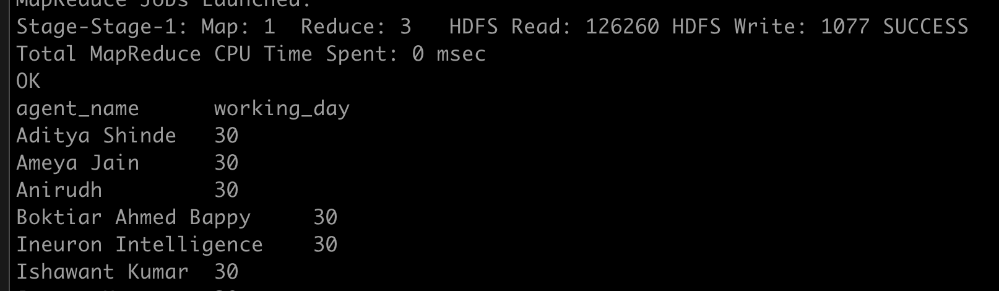
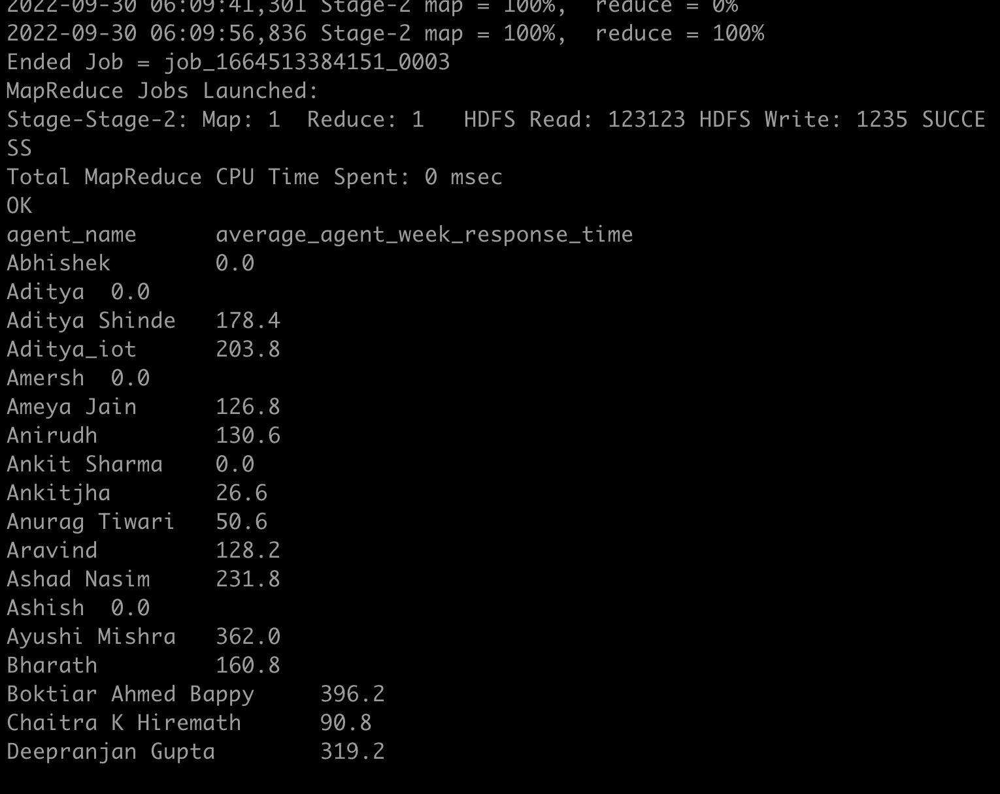
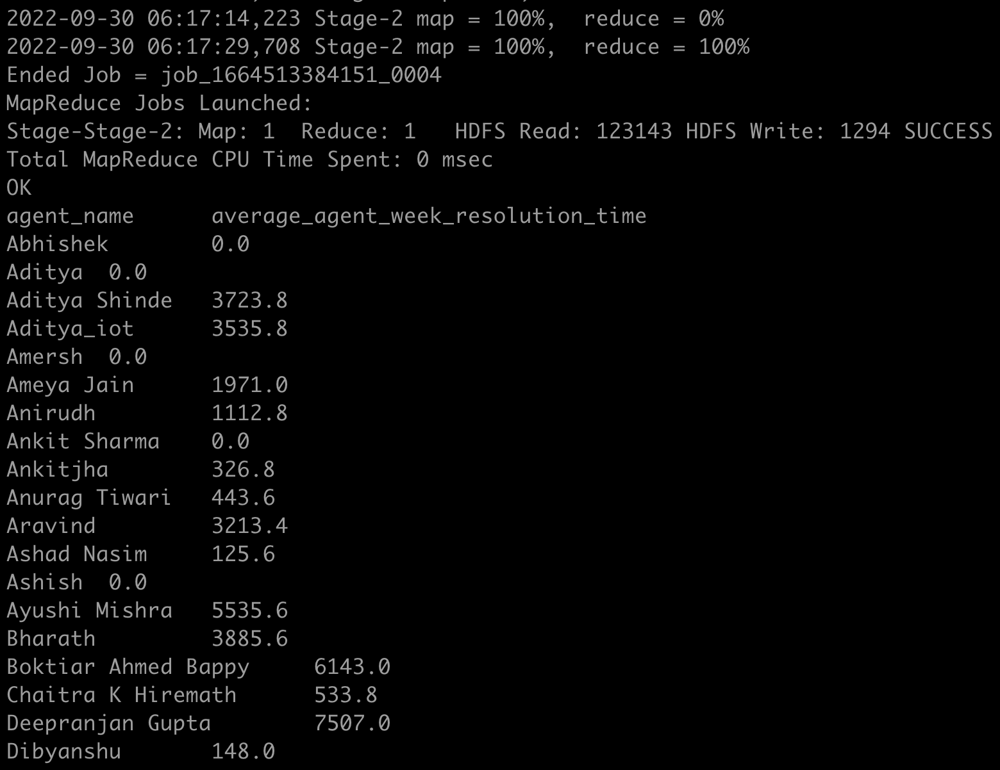

[Data-Set-1 AGentLoggingReport] (https://drive.google.com/file/d/1WrG-9qv6atP-W3P_-gYln1hHyFKRKMHP/view
)

[Data-set-2 Agent Performance] (https://drive.google.com/file/d/1-JIPCZ34dyN6k9CqJa-Y8yxIGq6vTVXU/view)

Note: both files are csv files.)]

## 1. Create a schema based on the given dataset

          CREATE TABLE agent_performance
    >   (
    >      id int,
    >      date string,
    >      total_chats int,
    >      average_response_time string,
    >      average_resolution_time string,
    >      rating float,
    >      feedback int
    >      )

    row format DELIMITED
    fields TERMINATED by ',';

## 2. Dump the data inside the hdfs in the given schema location.

## 3. List of all agents' names.

        SELECT agent_name FROM agent_performance_part_bucket

## 4. Find out agent average rating.

    hive> SELECT avg(rating) as avg_rating FROM agent_performance_part_bucket;

    avg_rating
    1.4609629649255012
    Time taken: 46.589 seconds, Fetched: 1 row(s)
    hive>

## 5. Total working days for each agents

#### 5.1

    - 30 days for each agent

#### 5.2 **Query**

    with unique_table as (SELECT distinct agent_name, date FROM agent_performance_part_bucket)

    SELECT agent_name, count(date) as working_day FROM unique_table GROUP BY agent_name;

#### 5.3 **Screen Shot of result**



## 6. Total query that each agent have taken

    SELECT agent_name, sum(total_chats) FROM agent_performance Group by agent_name;

## 7. Total Feedback that each agent have received

    SELECT agent_name, sum(feedback) FROM agent_performance Group by agent_name;

## 8. Agent name who have average rating between 3.5 to 4

    SELECT agent_name,rating FROM agent_performance Where rating between 3.5 and 4;

## 9. Agent name who have rating less than 3.5

    SELECT agent_name FROM agent_performance Where rating < 3.5;

## 10. Agent name who have rating more than 4.5

    SELECT agent_name FROM agent_performance Where rating > 4.5;

## 11. How many feedback agents have received more than 4.5 average

**8976**

    SELECT sum(feedback) FROM agent_performance WHERE feedback > 4.5;

## 12. average weekly response time for each agent

1. As here date and time(duration) is not in a proper format. So, here we are creating a new Python file which will have udf function.

- For average time durations. We are converting them in seconds in udf.

- For weekdays we are taking help of Python datetime module "isocalendar" method which directly
  return a tuple which contains calender weekdays.

2. Create a new table agent_support which will have calender days and time duration in seconds.
   later we we join this in agent_performance table on id column.

#### 12.1 Creating a pyhton file which contains UDF :

```python
import sys
import datetime

def cal_weekday(d_str):
    m,d,y = [int(i) for i in d_str.split('/')]
    dt = datetime.date(y,m,d)
    return str(dt.isocalendar()[1])

def seconds(t_str):
    h,m,s = t_str.split(':')
    return str((int(h)* 3600 + int(m)*60 + int(s)))

for line in sys.stdin:
	line = line.strip('\n\r')
	id, date, response_time, resolution_time = line.split('\t')
	date = cal_weekday(date)
	response_time = seconds(response_time)
	resolution_time = seconds(resolution_time)
	result = '\t'.join([str(id),date,response_time,resolution_time])
	print(result)
```

#### 12.2 agent support table

    CREATE TABLE agent_support
    (
        id int,
        week int,
        response_time int,
        resolution_time int
    )
    stored as orc;

#### 12.3 Inserting data into agent_support table with help of UDF.

    > INSERT INTO agent_support
    > select transform(id,date,average_response_time,average_resolution_time)
    > using 'python final.py' as (id int,week int, response_time int, resolution_time int)
    > FROM agent_performance;

#### 12.4 query to get average weekly response time for each agent

    SELECT
        agent_name,
        sum(r_time)/ count(agent_name) as average_agent_week_response_time

    FROM
     ( SELECT
            p.agent_name,s.week,sum(s.response_time) as r_time
        FROM
                agent_performance as p join agent_support as s
                on p.id = s.id
        GROUP BY
            p.agent_name,
            s.week ) as week_r_time

    GROUP BY
        agent_name

- result of query screenshot :
  

## 13. average weekly resolution time for each agents

    SELECT
        agent_name,
        sum(r_time)/ count(agent_name) as average_agent_week_response_time


    FROM
     ( SELECT
            p.agent_name,s.week,sum(s.resolution_time) as r_time
        FROM
                agent_performance as p join agent_support as s
                on p.id = s.id
        GROUP BY
            p.agent_name,
            s.week ) as week_r_time

    GROUP BY
        agent_name

- Screenshot of result :



## 14. Find the number of chat on which they have received a feedback

- 9259

  SELECT sum(feedback) as total_feedback FROM agent_performance;
